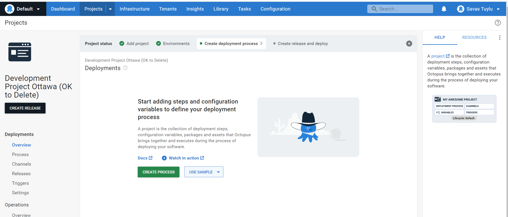

# OctopusDeploy Project Resource with Terraform

This example demonstrates how to create an Octopus Deploy project with various settings and configurations. It includes a connectivity policy, Jira Service Management extension settings, ServiceNow extension settings, and a project template.
